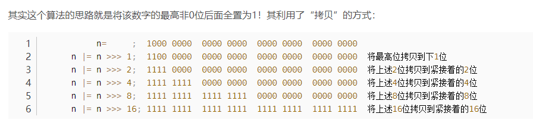

## 一、HashMap源码解析

### 	1、tableSizeFor方法解析

**源码**：

```java
	/**
     * Returns a power of two size for the given target capacity.
     */
    static final int tableSizeFor(int cap) {
        int n = cap - 1;
        n |= n >>> 1;
        n |= n >>> 2;
        n |= n >>> 4;
        n |= n >>> 8;
        n |= n >>> 16;
        return (n < 0) ? 1 : (n >= MAXIMUM_CAPACITY) ? MAXIMUM_CAPACITY : n + 1;
    }
```

该方法的作用是：返回一个大于cap最高位的2的n次幂的数，其中n |= n >>> 1代表无符号右移1位再或上n，效果如图：



MAXIMUM_CAPACITY = 2^30 也就是1024的3次方等于1g，代表hashmap的最大容量为1g

#### 1.1为什么会cap-1？

因为cap其实没有算自身就是2的n次幂这种情况，假如cap = 4，通过移位运算后得111，再加1， 返回值其实是8。

#### 1.2求解一个小于target的最大2 的n次幂的数

```java
public static int getMinBinLessValue(int value) {
		int resutl = value;
		resutl |= resutl >>> 1;
		resutl |= resutl >>> 2;
		resutl |= resutl >>> 4;
		resutl |= resutl >>> 8;
		resutl |= resutl >>> 16;
		
		return (resutl>>>1) + 1;
}
```

### 	2、put方法解析

**源码**:

```java
	public V put(K key, V value) {
        return putVal(hash(key), key, value, false, true);
    }

	static final int hash(Object key) {
        int h;
        return (key == null) ? 0 : (h = key.hashCode()) ^ (h >>> 16);
    }
    
    final V putVal(int hash, K key, V value, boolean onlyIfAbsent,
                   boolean evict) {
        Node<K,V>[] tab; Node<K,V> p; int n, i;
        if ((tab = table) == null || (n = tab.length) == 0)
            n = (tab = resize()).length;
        if ((p = tab[i = (n - 1) & hash]) == null)
            tab[i] = newNode(hash, key, value, null);
        else {
            Node<K,V> e; K k;
            if (p.hash == hash &&
                ((k = p.key) == key || (key != null && key.equals(k))))
                e = p;
            else if (p instanceof TreeNode)
                e = ((TreeNode<K,V>)p).putTreeVal(this, tab, hash, key, value);
            else {
                for (int binCount = 0; ; ++binCount) {
                    if ((e = p.next) == null) {
                        p.next = newNode(hash, key, value, null);
                        if (binCount >= TREEIFY_THRESHOLD - 1) // -1 for 1st
                            treeifyBin(tab, hash);
                        break;
                    }
                    if (e.hash == hash &&
                        ((k = e.key) == key || (key != null && key.equals(k))))
                        break;
                    p = e;
                }
            }
            if (e != null) { // existing mapping for key
                V oldValue = e.value;
                if (!onlyIfAbsent || oldValue == null)
                    e.value = value;
                afterNodeAccess(e);
                return oldValue;
            }
        }
        ++modCount;
        if (++size > threshold)
            resize();
        afterNodeInsertion(evict);
        return null;
    }
```

#### 2.1 为什么是通过(n - 1) & hash获取下标的

n在扩容时会强制要求是2的n次幂，而n-1换为2进制数后，全为1，这个时候和hash值做与运算可以最大限度的减少hash冲突

#### 2.2为什么hashmap还要自己再次做一次hash？

```java
	static final int hash(Object key) {
        int h;
        return (key == null) ? 0 : (h = key.hashCode()) ^ (h >>> 16);
    }
```

也是为了减少hash冲突，该方法的作用是将原生hashcode进行高低16位异或。如果只拿低位进行hash有可能最后四位都是0，那hash冲突的概率就会加打